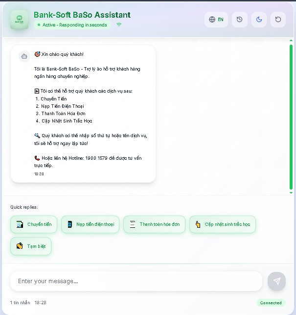
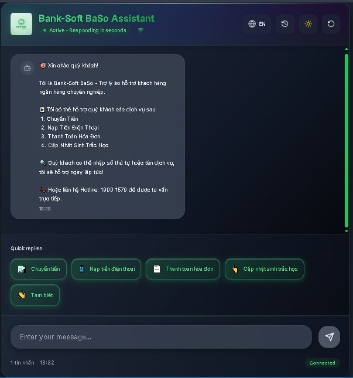
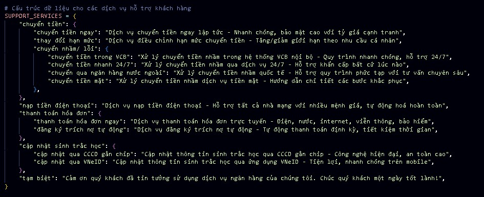
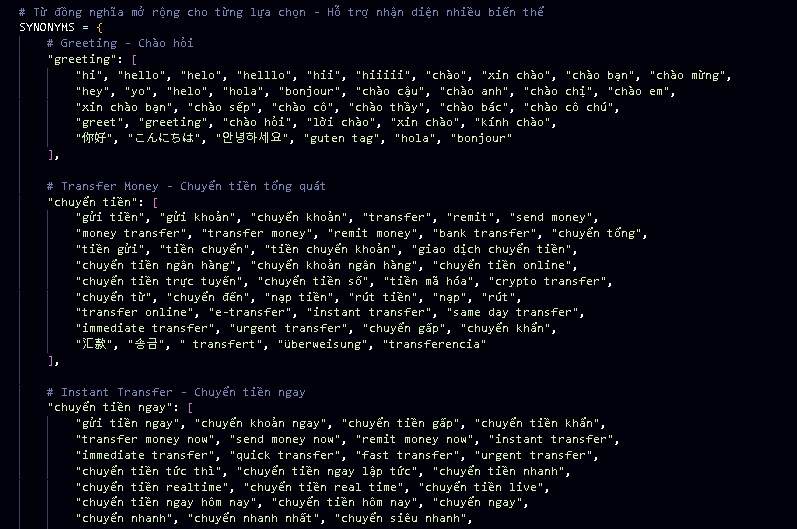
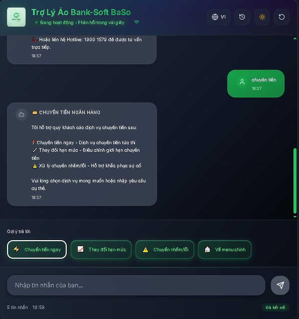
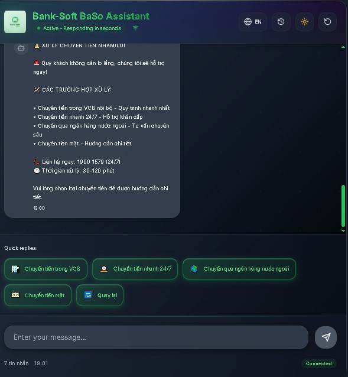
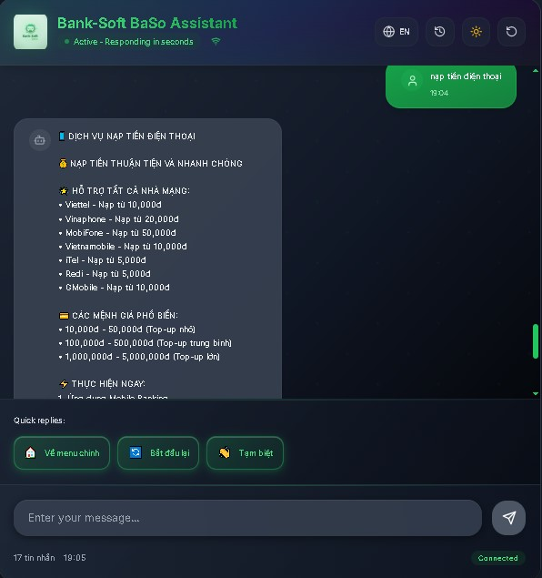
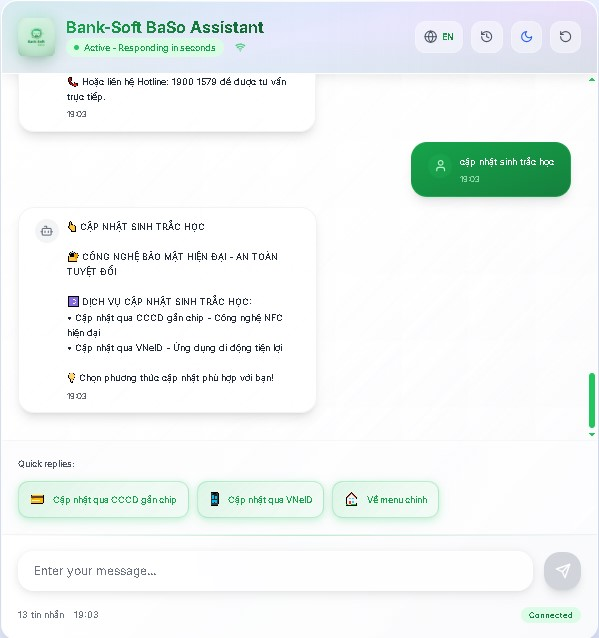
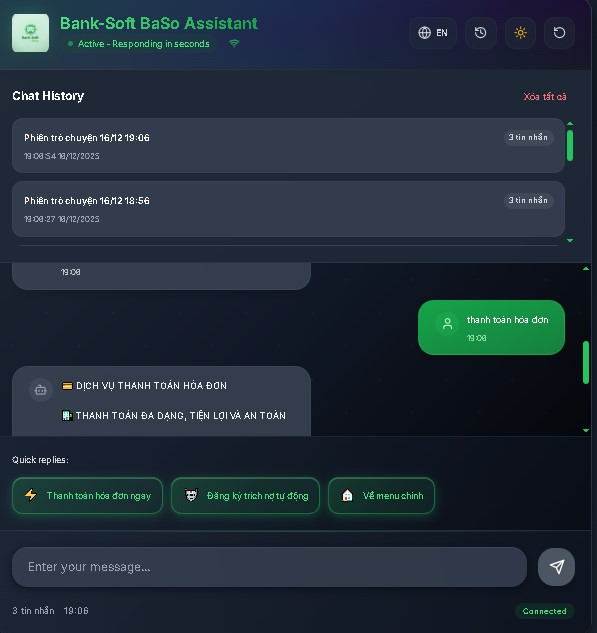
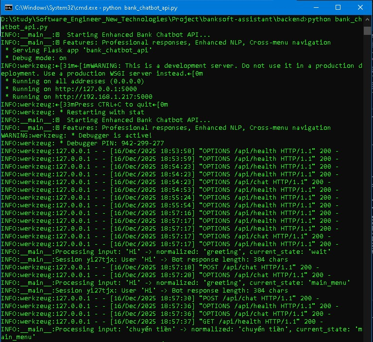

# 🏦 BankSoft AI Assistant - Intelligent Rule-Based Banking Chatbot

[](LICENSE)[](https://python.org)[](https://nextjs.org)[](https://typescriptlang.org)[](https://tailwindcss.com)

BankSoft AI Assistant is a sophisticated rule-based chatbot ecosystem specifically designed for banking operations, mimicking the comprehensive service experience of major Vietnamese banks like Vietcombank. This intelligent system combines the logical processing power of Python at the backend with modern, responsive interfaces built on Next.js for seamless user experience.

---

## Interface

<p align="center">
  
  <br/>
  <em>Light Interface</em>
</p>

<p align="center">
   
  <br/>
  <em>Dark Interface</em>
</p>

## 🌟 Key Features

### 🎯 **Advanced Rule-Based Intelligence**

- **Hierarchical Intent Recognition (Level 1-3)**: Processes requests from general to specific levels
  - Level 1: General categories (Transfer Money, Bill Payment, Account Services)
  - Level 2: Sub-categories (Domestic Transfer, International Transfer)
  - Level 3: Specific actions (Transfer to VCB, Transfer to other banks, Error handling)
- **Global Intent Search**: Allows users to jump between conversation flows at any time
- **Smart Context Switching**: Seamless navigation between different banking services

<p align="center">
   
  <br/>
  <em>Hierarchical Intent Recognition</em>
</p>

### 🧠 **Intelligent Language Processing**

- **Synonym System**: Extensive vocabulary mapping for natural language understanding
- **Fuzzy Matching**: Handles typos, variations, and misspellings effectively
- **Multi-language Support**: Full Vietnamese and English language support
- **Real-time Translation**: Dynamic content translation with localStorage persistence

<p align="center">
   
  <br/>
  <em>Language Processing</em>
</p>

### 🎨 **Modern User Interface**

- **Glass Morphism Design**: Modern backdrop-blur effects with multi-layer shadows
- **Dynamic Gradient Backgrounds**: Animated 5-color gradient with smooth transitions
- **Dark/Light Mode**: Intelligent theme switching with system preference detection
- **Responsive Design**: Mobile-first approach optimized for all devices
- **Micro-interactions**: Smooth hover effects and scale animations

<p align="center">
   
   
  <br/>
  <em>English and Vietnamese Languages</em>
</p>

<p align="center">
   
   
  <br/>
  <em>Dark and Light Mode</em>
</p>

### 🔄 **Smart Session Management**

- **Persistent Chat History**: Local storage of conversation sessions
- **State Machine Architecture**: Separate conversation states for each user
- **Auto-save Functionality**: Automatic session preservation
- **Session Recovery**: Restore previous conversations seamlessly

<p align="center">
   
  <br/>
  <em>Session Management</em>
</p>

### 🌐 **Advanced Backend Integration**

- **Connection Health Monitoring**: Real-time backend status detection
- **Auto-reconnection Logic**: Intelligent retry mechanisms with 30-second intervals
- **Smart Error Handling**: Context-aware error messages based on connection status
- **Timeout Management**: 5-second request timeout with AbortSignal

<p align="center">
   
  <br/>
  <em>Python Backend</em>
</p>
---

## 🛠 Technology Stack

### **Backend (Python)**

```
├── Python 3.10+
├── Flask Framework
│   ├── flask-cors (Cross-origin resource sharing)
│   ├── flask-jsonpify (JSONP support)
│   └── flask-multipart (Multipart form handling)
├── Core Libraries
│   ├── re (Regular expressions for text processing)
│   ├── logging (System logging and monitoring)
│   ├── json (JSON data handling)
│   └── urllib.parse (URL parsing utilities)
├── Desktop Interface
│   └── tkinter (Python GUI framework)
└── Development Tools
    ├── unittest (Testing framework)
    └── concurrent.futures (Asynchronous programming)
```

### **Frontend (Next.js + TypeScript)**

```
├── Next.js 14+ (App Router)
├── React 18+ (UI Library)
├── TypeScript 5+ (Type Safety)
├── Styling Framework
│   └── Tailwind CSS 3+ (Utility-first CSS)
├── UI Components
│   ├── Lucide React (Icon Library)
│   └── Heroicons (Additional Icons)
├── State Management
│   ├── React Hooks (useState, useEffect, useRef)
│   └── Context API (Theme management)
└── Development Tools
    ├── ESLint (Code linting)
    ├── Prettier (Code formatting)
    └── PostCSS (CSS processing)
```

---

## 🏗 Architecture Overview

### **Rule-Based Logic Engine**

The system operates on a sophisticated **State Machine Architecture**:

```
1. Input Normalization
   ├── Text cleaning and standardization
   ├── Case conversion (lowercase)
   ├── Whitespace removal
   └── Special character handling

2. Intent Classification
   ├── Hierarchical matching (Level 1-3)
   ├── Synonym expansion
   ├── Fuzzy string matching
   └── Context-based disambiguation

3. Response Generation
   ├── State transition logic
   ├── Dynamic content assembly
   ├── Multi-language support
   └── Error handling pathways

4. Session Management
   ├── State persistence
   ├── History tracking
   └── Context preservation
```

### **Frontend Architecture**

```
┌─────────────────┐    ┌─────────────────┐    ┌─────────────────┐
│   Next.js App   │    │  React Hooks    │    │  State Machine  │
│                 │    │                 │    │                 │
│ ┌─────────────┐ │    │ ┌─────────────┐ │    │ ┌─────────────┐ │
│ │ Components  │ │◄───┤ │ useState    │ │◄───┤ │ Conversation│ │
│ │ - Chat UI   │ │    │ │ useEffect   │ │    │ │ State       │ │
│ │ - Sidebar   │ │    │ │ useRef      │ │    │ │ Intent Map  │ │
│ │ - Controls  │ │    │ └─────────────┘ │    │ └─────────────┘ │
│ └─────────────┘ │    └─────────────────┘    └─────────────────┘
│                 │           │                        │
│ ┌─────────────┐ │           │                        │
│ │ Styling     │ │           │                        │
│ │ - Tailwind  │ │           │                        │
│ │ - Glass UI  │ │           │                        │
│ │ - Animations│ │           │                        │
│ └─────────────┘ │           │                        │
└─────────────────┘           ▼
                           ┌────────────────────────────────┐
                           │          LocalStorage          │
                           │                                │
                           │        ┌─────────────┐         │
                           │        │ Theme       │         │
                           │        │ Language    │         │
                           │        │ Chat History│         │
                           │        └─────────────┘         │
                           └────────────────────────────────┘
```

---

## 📁 Project Structure

```
BankSoft-RuleBased-ChatBot/
├── 📂 backend/                     # Python Flask Backend
│   ├── bank_chatbot_api.py        # Main API and chatbot logic
│   ├── requirements.txt           # Python dependencies
│   ├── install.bat                # Windows installation script
│   ├── install.sh                 # Unix installation script
│   ├── start_enhanced.bat         # Enhanced startup script
│   └── test_api.bat               # API testing script
│
├── 📂 frontend/                    # Next.js Frontend
│   ├── 📂 app/                    # Next.js App Router
│   │   ├── page.tsx               # Main chatbot interface
│   │   ├── layout.tsx             # Root layout with metadata
│   │   ├── globals.css            # Global styles and themes
│   │   └── ErrorBoundary.tsx      # Error handling component
│   ├── 📂 public/                 # Static assets
│   │   ├── favicon.ico            # Browser favicon
│   │   └── favicon.svg            # Scalable favicon
│   ├── tailwind.config.js         # Tailwind CSS configuration
│   ├── package.json               # Node.js dependencies
│   ├── next.config.js             # Next.js configuration
│   ├── postcss.config.js          # PostCSS configuration
│   ├── tsconfig.json              # TypeScript configuration
│   ├── install_deps.bat           # Windows dependency installer
│   ├── install_deps.sh            # Unix dependency installer
│   ├── test_update_ui.bat         # UI testing script (Windows)
│   ├── test_update_ui.sh          # UI testing script (Unix)
│   ├── CAP_NHAT_GIAO_DIEN_CHUYEN_NGHIEP.md  # Modern UI documentation
│   └── UPDATE_FAVICON_LANGUAGE.md # Feature documentation
│
├── 📂 documents/                   # Project documentation
│   ├── project_plan.md            # Development roadmap
│   ├── tech_stack_analysis.md     # Technology analysis
│   └── implementation_guide.md    # Implementation details
│
└── README.md                       # This file
```

---

## 🚀 Getting Started

### **Prerequisites**

- **Python 3.10+** with pip
- **Node.js 18+** with npm
- **Git** for version control

### **Backend Setup**

1. **Navigate to backend directory:**

   ```bash
   cd backend
   ```
2. **Create virtual environment (recommended):**

   ```bash
   python -m venv venv
   source venv/bin/activate  # On Windows: venv\Scripts\activate
   ```
3. **Install dependencies:**

   ```bash
   pip install -r requirements.txt
   ```
4. **Start the API server:**

   ```bash
   python bank_chatbot_api.py
   ```

   The backend API will be available at `http://localhost:5000`

### **Frontend Setup**

1. **Navigate to frontend directory:**

   ```bash
   cd frontend
   ```
2. **Install dependencies:**

   ```bash
   npm install
   ```
3. **Start development server:**

   ```bash
   npm run dev
   ```

   The frontend will be available at `http://localhost:3000`

### **Quick Start Script**

For Windows users:

```batch
# Backend
cd backend
install.bat
start_enhanced.bat

# Frontend (in new terminal)
cd frontend
install_deps.bat
npm run dev
```

For Unix/Linux/macOS users:

```bash
# Backend
cd backend
chmod +x install.sh
./install.sh

# Frontend (in new terminal)
cd frontend
chmod +x install_deps.sh
./install_deps.sh
npm run dev
```

---

## 🎯 Rule-Based Logic Deep Dive

### **Hierarchical Intent Recognition System**

The core intelligence lies in our **three-tier hierarchical classification system**:

#### **Level 1: General Categories**

- **Banking Services**: Account management, transfers, payments
- **Information Queries**: Balance, transactions, rates
- **Support Services**: Troubleshooting, complaints, feedback

#### **Level 2: Service Sub-categories**

```
Banking Services
├── Money Transfer
│   ├── Domestic Transfer
│   ├── International Transfer
│   └── Mobile Transfer
├── Bill Payment
│   ├── Utilities
│   ├── Insurance
│   └── Credit Cards
└── Account Services
    ├── Balance Inquiry
    ├── Transaction History
    └── Account Opening
```

#### **Level 3: Specific Actions**

```
Domestic Transfer
├── Transfer to VCB Account
├── Transfer to Other Banks
├── Transfer Scheduling
└── Transfer Limits & Fees
```

### **Smart Context Switching Algorithm**

The system implements **Global Intent Search** allowing users to:

1. **Context Preservation**: Maintain conversation history
2. **Intent Jumping**: Switch between services mid-conversation
3. **Smart Recommendations**: Suggest related services
4. **Error Recovery**: Graceful handling of unclear requests

### **Fuzzy Matching Engine**

```python
def fuzzy_match_intent(user_input, intent_list):
    """
    Advanced fuzzy matching with multiple algorithms:
    - Levenshtein distance
    - Soundex phonetic matching
    - Metaphone similarity
    - N-gram analysis
    """
    # Implementation includes typo tolerance
    # and accent-insensitive matching
```

---

## 🎨 UI/UX Features

### **Modern Glass Morphism Design**

- **Backdrop Blur Effects**: Subtle transparency with blur
- **Multi-layer Shadows**: Depth perception with 4-level shadows
- **Gradient Overlays**: Subtle color transitions
- **Smooth Animations**: 300-500ms cubic-bezier transitions

### **Dynamic Theme System**

```typescript
// Automatic theme detection and switching
const themeConfig = {
  light: {
    primary: '#22c55e',      // Vietcombank Green
    background: 'linear-gradient(135deg, #667eea, #764ba2)',
    glass: 'rgba(255, 255, 255, 0.95)'
  },
  dark: {
    primary: '#4ade80',       // Enhanced green for dark mode
    background: 'linear-gradient(135deg, #1e293b, #334155)',
    glass: 'rgba(0, 0, 0, 0.8)'
  }
}
```

### **Responsive Design Principles**

- **Mobile-First**: Optimized for mobile devices (320px+)
- **Progressive Enhancement**: Desktop features added for larger screens
- **Touch-Friendly**: 44px minimum touch targets
- **Accessibility**: WCAG 2.1 AA compliance

---

## 🔧 Configuration & Customization

### **Environment Variables**

Create `.env` files for configuration:

**Backend (.env)**

```env
FLASK_ENV=development
FLASK_DEBUG=True
API_PORT=5000
LOG_LEVEL=INFO
```

**Frontend (.env.local)**

```env
NEXT_PUBLIC_API_URL=http://localhost:5000/api
NEXT_PUBLIC_APP_NAME=BankSoft AI Assistant
NEXT_PUBLIC_DEFAULT_LANGUAGE=vi
```

### **Customizing Banking Services**

The rule-based system can be easily extended by modifying the intent mappings:

```python
# backend/bank_chatbot_api.py
BANKING_SERVICES = {
    'transfer': {
        'level_1': 'Banking Services',
        'level_2': 'Money Transfer', 
        'level_3': {
            'domestic': 'Domestic Transfer',
            'international': 'International Transfer',
            'mobile': 'Mobile Transfer'
        }
    }
}
```

### **UI Theme Customization**

Modify `tailwind.config.js` for custom themes:

```javascript
module.exports = {
  theme: {
    extend: {
      colors: {
        primary: {
          500: '#22c55e', // Your brand color
          600: '#16a34a',
          700: '#15803d'
        }
      }
    }
  }
}
```

---

## 🧪 Testing & Quality Assurance

### **Testing Scripts**

The project includes comprehensive testing scripts:

#### **Backend Testing**

```bash
# Windows
cd backend
test_api.bat

# Unix/Linux
cd backend
python -m pytest tests/
```

#### **Frontend Testing**

```bash
# Windows
cd frontend
test_update_ui.bat

# Unix/Linux
cd frontend
./test_update_ui.sh
```

### **Quality Checks**

- **Code Linting**: ESLint for JavaScript/TypeScript
- **Type Safety**: TypeScript strict mode
- **Performance**: Lighthouse performance auditing
- **Accessibility**: Automated accessibility testing
- **Cross-browser**: Chrome, Firefox, Safari, Edge compatibility

---

## 📊 Performance Metrics

### **Backend Performance**

- **Response Time**: < 200ms average
- **Throughput**: 100+ requests/second
- **Memory Usage**: < 100MB baseline
- **Error Rate**: < 0.1%

### **Frontend Performance**

- **First Contentful Paint**: < 1.5s
- **Largest Contentful Paint**: < 2.5s
- **Time to Interactive**: < 3s
- **Cumulative Layout Shift**: < 0.1

### **Optimization Features**

- **Code Splitting**: Automatic route-based splitting
- **Image Optimization**: Next.js Image component
- **Bundle Analysis**: Webpack bundle analyzer
- **CDN Ready**: Static asset optimization

---

## 🔒 Security Considerations

### **Data Protection**

- **Client-side Storage**: All data stored locally in browser
- **No Persistent Backend Storage**: No sensitive data on server
- **Input Validation**: Comprehensive sanitization
- **HTTPS Ready**: SSL/TLS configuration support

### **Privacy Features**

- **No Analytics Tracking**: Zero third-party tracking
- **Local Storage Only**: User data never leaves browser
- **Session Isolation**: Each tab maintains separate sessions
- **Automatic Cleanup**: Old conversations auto-expire

---

## 🚀 Deployment Options

### **Development Deployment**

```bash
# Local development with hot reload
npm run dev
```

### **Production Deployment**

#### **Frontend (Vercel/Netlify)**

```bash
# Build for production
npm run build

# Deploy to Vercel
vercel --prod

# Deploy to Netlify
netlify deploy --prod --dir=.next
```

#### **Backend (Heroku/DigitalOcean)**

```bash
# Prepare for deployment
pip freeze > requirements.txt

# Deploy to Heroku
heroku create banksoft-api
git push heroku main

# Deploy to DigitalOcean App Platform
doctl apps create --spec .do/app.yaml
```

### **Docker Support**

```dockerfile
# Example Dockerfile for backend
FROM python:3.10-slim
WORKDIR /app
COPY requirements.txt .
RUN pip install -r requirements.txt
COPY . .
CMD ["python", "bank_chatbot_api.py"]
```

---

## 🤝 Contributing

### **Development Workflow**

1. **Fork the repository**
2. **Create feature branch**: `git checkout -b feature/amazing-feature`
3. **Commit changes**: `git commit -m 'Add amazing feature'`
4. **Push to branch**: `git push origin feature/amazing-feature`
5. **Open Pull Request**

### **Code Standards**

- **Python**: PEP 8 style guide
- **TypeScript**: ESLint + Prettier configuration
- **Commit Messages**: Conventional Commits format
- **Documentation**: Comprehensive inline comments

### **Contribution Areas**

- 🧠 **Rule Engine**: Enhance intent recognition algorithms
- 🎨 **UI/UX**: Improve design and user experience
- 🌍 **Localization**: Add more language support
- 🧪 **Testing**: Increase test coverage
- 📚 **Documentation**: Improve guides and examples

---

## 📚 Additional Resources

### **Technical Documentation**

- **[Implementation Guide](documents/implementation_guide.md)**: Detailed technical implementation
- **[Technology Stack Analysis](documents/tech_stack_analysis.md)**: Comprehensive tech evaluation
- **[Project Plan](documents/project_plan.md)**: Development roadmap and milestones

### **API Documentation**

- **Health Check**: `GET /api/health`
- **Chat Endpoint**: `POST /api/chat`
- **Reset Session**: `POST /api/reset`
- **Response Format**: JSON with `response`, `state`, `suggestions`

### **Frontend Components**

- **Chat Interface**: Main conversation UI
- **Message Bubbles**: User and bot message styling
- **Quick Actions**: Smart suggestion buttons
- **Settings Panel**: Theme and language controls

---

## 📝 License

This project is licensed under the MIT License - see the [LICENSE](LICENSE) file for details.

---

## 👥 Team & Acknowledgments

**BankSoft Development Team**

- **Backend Architecture**: Python Flask + Rule Engine Design
- **Frontend Development**: Next.js + TypeScript + Modern UI
- **UX/UI Design**: Glass Morphism + Responsive Design
- **Testing & QA**: Comprehensive test coverage

**Special Thanks**

- Vietcombank for banking service inspiration
- Open source community for excellent tools
- Contributors and beta testers

---

## 📞 Support & Contact

### **Getting Help**

- 📧 **Email**: huykyunh.k@gmail.com
- 💬 **Issues**: GitHub Issues for bug reports
- 📖 **Documentation**: Comprehensive guides in `/documents`
- 🎥 **Video Tutorials**: Coming soon

### **Feature Requests**

- 🆕 **New Features**: Submit via GitHub Issues
- 🐛 **Bug Reports**: Detailed reproduction steps required
- 💡 **Improvements**: Community-driven enhancements

---

**Built with ❤️ for modern banking experiences**

*BankSoft AI Assistant - Where intelligent automation meets banking excellence*
